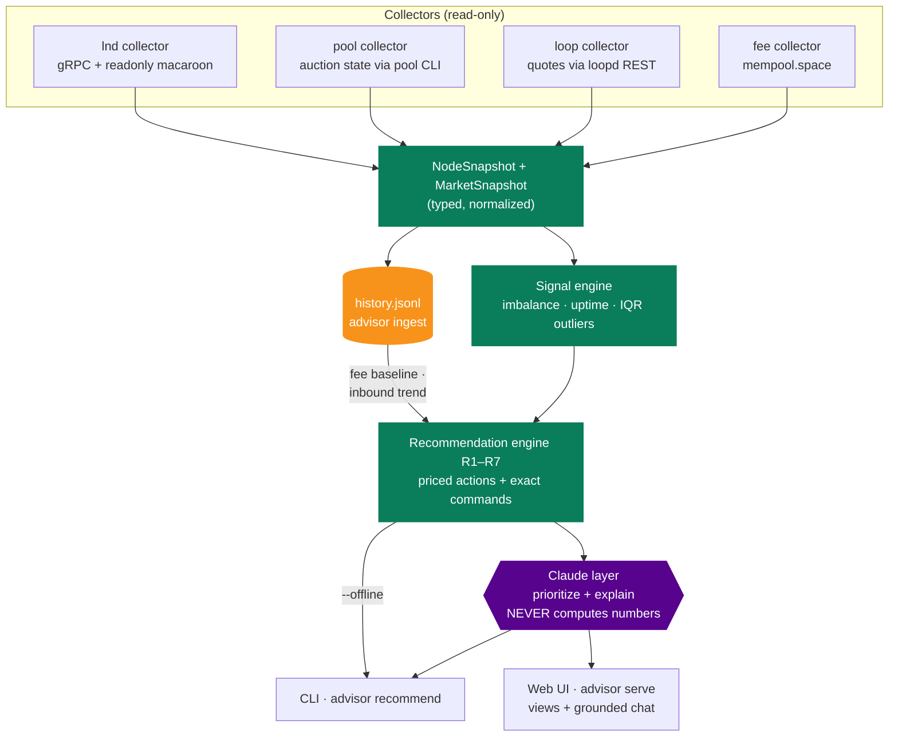
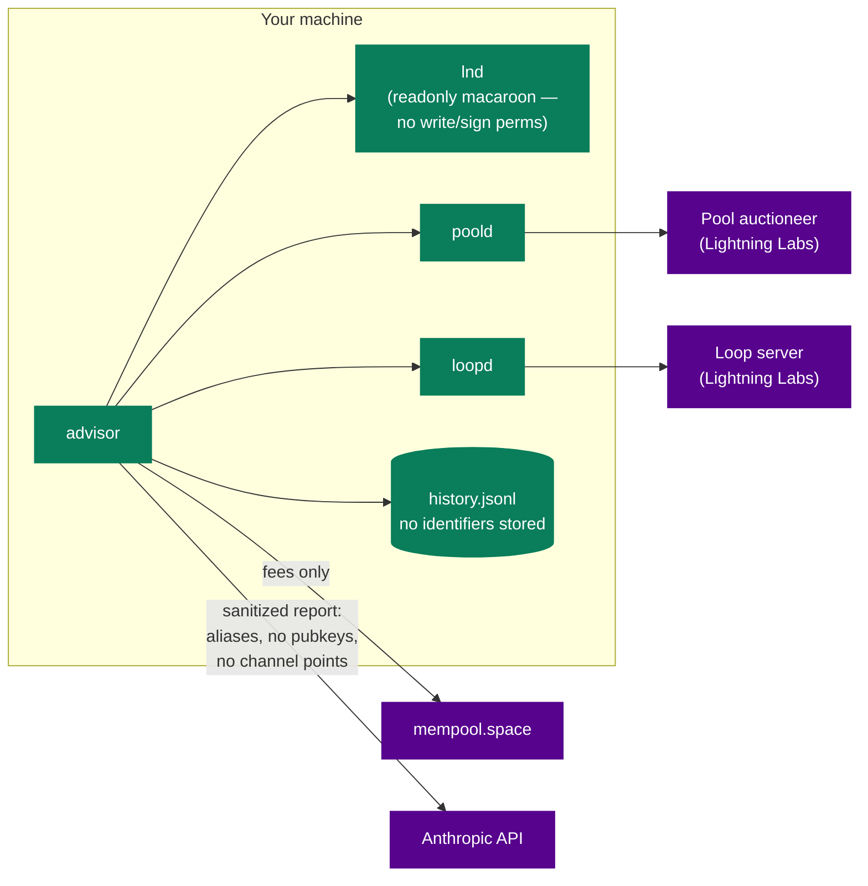
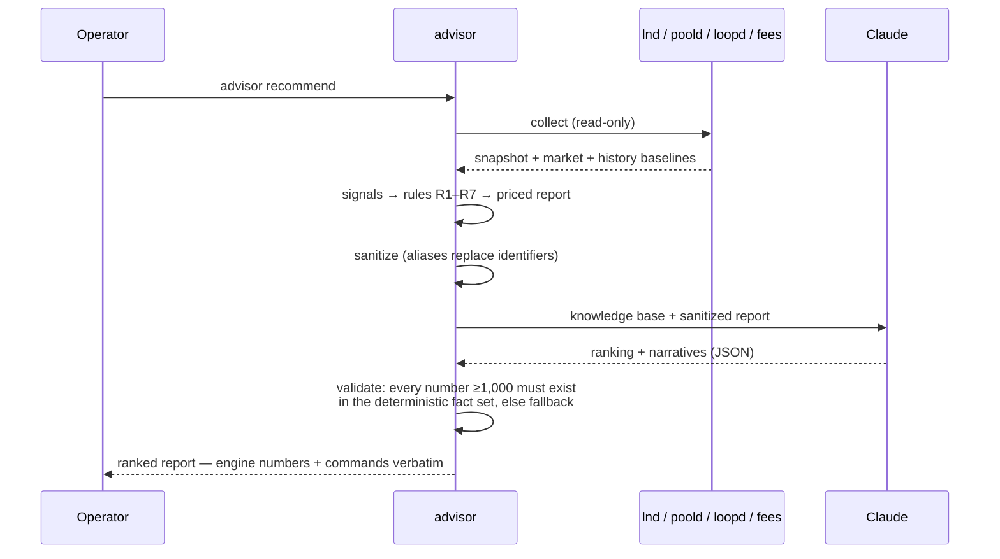

# 🧭 Lightning Liquidity Advisor

**Lightning node operators struggle to know when and how to manage channel
liquidity — the Advisor reads a node's actual state and gives plain-language,
actionable recommendations.**

A **read-only, recommend-only** tool for `lnd` nodes: it collects node,
market, and fee data; computes liquidity signals and priced recommendations
deterministically; and uses Claude to prioritize and explain them — with the
hard rule that **the model never does arithmetic**. It emits the exact
command for each action; you run it. It cannot move funds.

> **Status: stable MVP** (spec milestones M0–M5 complete, 64 tests across 7
> suites, user flows and failure modes tested live against a testnet
> lnd + poold + loopd stack). Design record: [SPEC.md](./SPEC.md) ·
> demo script: [DEMO.md](./DEMO.md) · LLM corpus: [knowledge/](./knowledge/).

---

## What it does

- **Snapshot** your node: balances and per-channel inbound/outbound (the
  liquidity seesaw).
- **Signals**: imbalance, uptime, routing performance per unit of committed
  capital, and Faraday-style IQR outlier detection — statistical relativity,
  no magic thresholds.
- **Market awareness**: live mempool fees, the Pool auction (clearing rates,
  depth, next-batch feerate), and Loop In/Out quotes.
- **Recommendations (R1–R7)**: acquire inbound (Loop Out vs. Pool bid,
  priced side by side), acquire outbound, close underperformers, rebalance,
  retune fees, defer chain actions when fees are hot, consolidate small
  orders — each with computed cost/benefit and a ready-to-run command.
- **Trends**: an append-only local history powers a 7-day fee baseline and
  an inbound **runway** rule ("you run dry in ~4 days") that fires *before*
  the silent receive-failure, not after.
- **Two surfaces**: a rich CLI and a local web UI with a chat panel grounded
  in the same data.

## Architecture

Deterministic core, LLM at the edge. The first four stages are pure,
unit-tested code; Claude only prioritizes and phrases; every number in the
output traces back to the engine.



### Trust boundaries

Everything sensitive stays on your machine. The only outbound calls are the
public fee API and — for the optional LLM layer — a **sanitized** payload
where every pubkey, channel point, and alias is replaced before it leaves.



### One `advisor recommend`, end to end



### The guarantees, in one table

| Guarantee | Enforced by |
| --- | --- |
| Cannot move funds | readonly macaroon; no write/sign RPCs imported |
| Numbers are never invented | all math in `recommend/economics.py`, unit-tested; LLM prose validated against the fact set, rejected on mismatch |
| Commands are exact | generated by the engine; chat quotes them character-for-character |
| Nothing identifying leaves | privacy filter aliases pubkeys/channel points/alias before any prompt; history stores no identifiers |
| Works without the LLM | `--offline` and key-less operation always produce the full deterministic report |

## Quickstart

```bash
cd advisor
python3 -m venv .venv && . .venv/bin/activate
pip install -e .
./scripts/gen_proto.sh          # generate gRPC stubs from vendored protos

# point at your node (defaults target a local testnet lnd)
export ADVISOR_RPC_HOST=localhost:10010
export ADVISOR_NETWORK=testnet

advisor snapshot                # M0: what does my node look like?
advisor recommend               # the point of the tool
advisor serve                   # web UI on http://127.0.0.1:8899
```

Optional but recommended — a least-privilege credential and the LLM key:

```bash
lncli bakemacaroon info:read offchain:read onchain:read --save_to advisor.macaroon
export ADVISOR_MACAROON_PATH=$PWD/advisor.macaroon

cp .env.example .env            # then put ANTHROPIC_API_KEY in .env (gitignored)
```

## Commands

| Command | What it does |
| --- | --- |
| `advisor snapshot` | Read-only node state: identity, balances, per-channel in/outbound |
| `advisor signals` | Deterministic liquidity signals + IQR outlier flags (`--multiplier`) |
| `advisor market` | Live mempool fees, Pool auction state, Loop quotes |
| `advisor ingest` | Append one history record (`--quiet` for cron: `0 * * * * advisor ingest --quiet`) |
| `advisor history` | The ingested time series + fee baseline + inbound trend |
| `advisor recommend` | Ranked recommendations with economics + commands (`--offline`, `--all`, `--json`) |
| `advisor serve` | Local web UI: recommendation views + grounded chat (`--port`, default 8899) |

Every command takes `--network` / `--host`; all settings are overridable via
`ADVISOR_*` env vars or a local `.env`.

## Configuration

| Setting (env) | Default | Purpose |
| --- | --- | --- |
| `ADVISOR_NETWORK` | `testnet` | bitcoin network |
| `ADVISOR_RPC_HOST` | `localhost:10010` | lnd gRPC |
| `ADVISOR_LNDDIR` | `~/Library/Application Support/Lnd-testnet` | derives macaroon + TLS paths |
| `ADVISOR_MACAROON_PATH` | `<lnddir>/…/readonly.macaroon` | credential (read-only!) |
| `ADVISOR_POOL_BIN` | `pool` | Pool CLI used as poold interface |
| `ADVISOR_LOOP_REST_HOST` / `ADVISOR_LOOP_DIR` | `localhost:8091` / `/tmp/loopbuild/data` | loopd REST + auth files |
| `ADVISOR_HISTORY_PATH` | `~/.advisor/history.jsonl` | ingestion store |
| `ADVISOR_LLM_MODEL` | `claude-sonnet-4-5` | LLM layer model |
| `ANTHROPIC_API_KEY` | — | enables LLM layer + chat (in `.env`) |

## Troubleshooting

- **`lnd unreachable`** — is lnd running and the wallet unlocked
  (`lncli unlock`)? Check `ADVISOR_RPC_HOST` / `ADVISOR_LNDDIR`.
- **`macaroon not found`** — set `ADVISOR_MACAROON_PATH` (ideally a baked
  least-privilege macaroon, see Quickstart).
- **Pool/Loop shown offline** — `poold`/`loopd` aren't running or are on
  different ports. Market-dependent rules skip gracefully and say so.
- **Chat says offline** — set `ANTHROPIC_API_KEY` in `advisor/.env`. Views
  and `--offline` recommendations never need it.
- **Baseline/trend say "needs ≥3 records"** — schedule `advisor ingest`;
  trends also need records spanning ≥1 hour.
- **Port 8899 in use** — `advisor serve --port <other>`.

## Tests

```bash
for t in tests/test_*.py; do PYTHONPATH=src python "$t"; done
```

64 deterministic tests: model math, the IQR port pinned to Faraday's
documented examples, market parsers on captured live payloads, rule
economics pinned to the study notes' worked examples, privacy filter and
number contract, ingestion/trends, and the web API (including degraded
modes). No test touches the network.

## Layout

```
advisor/
├── SPEC.md                  design record (+ §10 as-built)
├── DEMO.md                  5-minute demo walkthrough
├── knowledge/               curated corpus the LLM layer loads
├── proto/lightning.proto    vendored lnd proto (v0.19.0-beta)
├── scripts/gen_proto.sh     regenerate gRPC stubs
├── src/advisor/
│   ├── config.py            settings (env/.env overridable)
│   ├── models.py            typed snapshot + market models
│   ├── lndclient.py         read-only gRPC client
│   ├── collectors/          lnd · pool · loop · fees
│   ├── signals/             IQR dataset + signal engine
│   ├── recommend/           economics + rules R1–R7 + ranking
│   ├── llm/                 privacy filter + Claude layer
│   ├── history.py           ingestion store + baselines/trends
│   ├── web/                 FastAPI server + single-file UI
│   ├── lnrpc/               generated gRPC stubs
│   └── cli.py               the `advisor` CLI
└── tests/                   7 suites, 64 tests
```

---

_Part of [Lightning Labs Prep](../README.md). Built on the mechanics
documented in the repo's [study notes](../README.md#foundations) and
[source reviews](../README.md#source-code-analysis) (Pool, LND, Loop,
Faraday — Faraday's recommend-only engine is the architectural blueprint).
MIT license._
