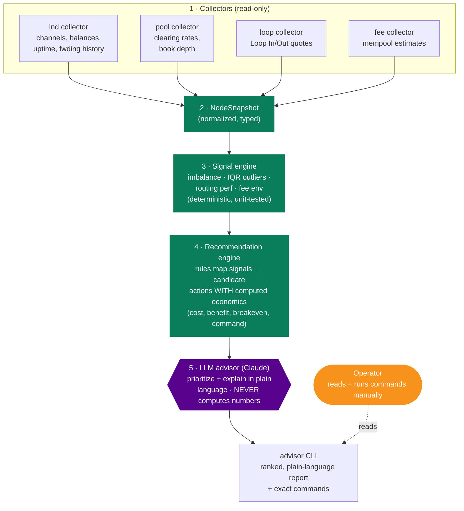

# Lightning Liquidity Advisor — Product & Technical Spec

> **Problem statement.** Lightning node operators struggle to know when and how
> to manage channel liquidity — the Advisor reads a node's actual state and gives
> plain-language, actionable recommendations.

_Design record for the AI Liquidity Advisor. Author: Delleon McGlone. Status:
draft v1 (planning). This spec is informed directly by the four source reviews in
this repo — [Pool](../repo-reviews/pool.md), [LND](../repo-reviews/lnd.md),
[Loop](../repo-reviews/loop.md), and especially [Faraday](../repo-reviews/faraday.md),
whose recommend-only engine is the architectural blueprint._

---

## 1. Vision & scope

The Advisor is a **read-only, recommend-only** tool. It connects to a single
`lnd` node (plus live Pool/Loop market data and the on-chain fee environment),
computes liquidity signals deterministically, and uses an LLM to turn those
signals into **prioritized, plain-language recommendations** with the numbers and
the exact commands to run. It never moves funds and never holds keys that could.

Think **Faraday's close-recommendation engine, generalized**: Faraday only tells
you which channels to *close*; the Advisor also tells you when to *acquire*
inbound/outbound (Loop vs. Pool, priced), *rebalance*, *retune fees*, and *wait
for cheaper chain fees* — and it explains each in language a non-expert operator
can act on.

### Decisions locked for v1

| Decision | Choice | Rationale |
| --- | --- | --- |
| Language / runtime | **Python 3.12** | Best Claude SDK + stats tooling; talks to lnd/poold/loopd via generated gRPC stubs |
| First surface | **CLI** (`advisor`) | Fastest to a working, demoable MVP; mirrors `frcli`/`pool`/`loop` |
| Data sources | **lnd + Pool/Loop market + on-chain fees** | Fee-aware, market-priced recs from day one (the Pool `(rate, max_batch_feerate)` insight) |
| LLM | **Claude** (latest capable model) | Strong structured-reasoning + explanation; Anthropic SDK |

### Non-goals (v1)

- **Never executes** anything — no opening/closing channels, no swaps, no orders.
  It emits the command; the operator runs it.
- Not a monitoring/alerting daemon (v1 is on-demand CLI; watch-mode is a stretch
  goal).
- Not multi-node / fleet management.
- Not a custody or key-management tool.

---

## 2. Requirements

### 2.1 Functional

| ID | Requirement |
| --- | --- |
| **FR1** | Connect to `lnd` over gRPC using a **least-privilege, read-only macaroon** (not `admin.macaroon`). |
| **FR2** | Collect node state: channels (capacity, local/remote balance, active, private), peer info, uptime, on-chain + channel balances, and forwarding history. |
| **FR3** | Collect **market state**: Pool clearing rates per duration bucket and current book depth (via `poold`); Loop In/Out quotes (via `loopd`). |
| **FR4** | Collect the **on-chain fee environment** (mempool fee estimates at several confirmation targets). |
| **FR5** | Compute **liquidity signals** deterministically: per-channel inbound/outbound ratio, imbalance, routing performance, uptime, and Faraday-style IQR outliers over revenue/volume. |
| **FR6** | Map signals → **candidate actions** with computed economics (cost, expected benefit, breakeven) — see the recommendation catalog (§5). |
| **FR7** | Use the LLM to **prioritize and explain** candidate actions in plain language, producing a ranked recommendation list. The LLM phrases and orders; it does **not** compute the numbers. |
| **FR8** | Each recommendation includes: the plain-language advice, the **underlying data** that triggered it, the **estimated cost/benefit**, and the **exact command** the operator can run to act on it. |
| **FR9** | CLI output: a readable ranked report (`advisor recommend`), plus subcommands to inspect raw signals (`advisor signals`) and node snapshot (`advisor snapshot`). |
| **FR10** | Run against **testnet and mainnet** (network-configurable), reusing the setup from [Pool operations](../setup/pool.md). |

### 2.2 Non-functional

| ID | Requirement |
| --- | --- |
| **NFR1 — Safety** | Recommend-only. The process is architecturally incapable of moving funds (read-only macaroon; no signing/write RPCs in scope). |
| **NFR2 — Least privilege** | Uses a custom-baked macaroon scoped to the read entities/actions it needs (`info:read`, `offchain:read`, `onchain:read`), per the [LND macaroon model](../repo-reviews/lnd.md#3d-macaroon-permissions--rest). |
| **NFR3 — Privacy** | Raw node data stays local. Only **aggregated, non-identifying signals** are sent to the LLM — never channel points, pubkeys, macaroons, or preimages. A `--offline` mode produces deterministic recs with no LLM call. |
| **NFR4 — Determinism** | All economics (fees, breakeven, APR/ppb, swap costs) are computed in code and unit-tested. The LLM never does arithmetic; it consumes computed values. This makes recommendations reproducible and auditable. |
| **NFR5 — Transparency** | Every recommendation is traceable to the signal + data that produced it (no black-box advice). |
| **NFR6 — Extensibility** | New recommendation types are added as self-contained rules implementing a common interface. |

---

## 3. User stories

**Persona A — Priya, the merchant/receiver.** Runs a node to accept payments;
not a Lightning expert. Cares about *reliably receiving*.

- As a merchant, I want to be told **when I'm about to run out of inbound
  liquidity**, so that customer payments don't silently fail.
- As a merchant, I want the Advisor to tell me the **cheapest way to get more
  inbound** right now (Loop Out vs. a Pool bid, priced), so that I don't overpay.
- As a non-expert, I want recommendations in **plain language with the exact
  command**, so that I can act without understanding the internals.

**Persona B — Ravi, the routing-node operator.** Optimizing yield on committed
capital; sophisticated.

- As a routing operator, I want to know **which channels are underperforming**
  (Faraday-style outliers), so that I can close or retune them.
- As a routing operator, I want **fee-aware timing** — "don't do that on-chain
  action now, mempool is hot" — so that I don't burn sats on chain fees (the Pool
  `max_batch_feerate` lesson).
- As a routing operator, I want **rebalance suggestions** with the expected cost,
  so that I keep channels forwarding in both directions.

**Persona C — Sam, the new operator.** Just set up a node; overwhelmed.

- As a new operator, I want a **single "what should I do next?" summary**, so
  that I'm not paralyzed by choices.
- As a new operator, I want each recommendation to **explain why**, so that I
  learn the mental model while acting.

**Cross-cutting**

- As any operator, I want to **trust that the tool can't touch my funds**, so
  that I can run it without risk.
- As any operator, I want to run it **on testnet first**, so that I can see what
  it says before trusting it on mainnet.

---

## 4. Architecture

A five-layer pipeline. The first three layers are **fully deterministic**; the
LLM sits near the end and only phrases/prioritizes; the CLI presents.



### 4.1 The core design principle

**Deterministic core, LLM at the edge.** This is the single most important
architectural decision, taken straight from the Faraday review's "recommend,
never act" + "statistical relativity beats magic numbers" lessons, hardened with
one more rule: **the LLM never touches arithmetic.** All costs, breakevens, APR
conversions, and swap economics are computed in tested Python and handed to the
model as facts. The LLM's job is judgment and language — which recommendations
matter most for *this* operator, and how to say them clearly. This keeps the
tool auditable (you can trace every number) and safe (a hallucinated fee can't
reach the operator as a real figure).

### 4.2 Components & tech stack

| Layer | Component | Tech |
| --- | --- | --- |
| Collectors | `lnd`/`pool`/`loop` gRPC clients | `grpcio` + stubs generated from the vendored `.proto` files |
| | fee collector | mempool.space API (or `lnd` `EstimateFee`) |
| Snapshot | `NodeSnapshot`, `ChannelState`, `MarketState`, `FeeEnvironment` | `pydantic` typed models |
| Signal engine | imbalance, IQR outliers, routing perf | pure Python + `statistics` (ports Faraday's `dataset` IQR) |
| Recommendation engine | rule set → `Recommendation` objects | plugin-style rule interface |
| LLM advisor | prioritize + explain | `anthropic` SDK (Claude) |
| CLI | `advisor` command | `typer` + `rich` for tables/formatting |
| Config | node conn, network, thresholds | `pydantic-settings` + a config file |

### 4.3 Credential model (NFR1/NFR2)

At setup the operator bakes a scoped macaroon:

```bash
lncli bakemacaroon info:read offchain:read onchain:read \
  --save_to advisor.macaroon
```

The Advisor loads only `advisor.macaroon`. Because the write/sign entities are
absent, the process **cannot** open/close channels, sign, or spend — safety is
enforced by the credential, not just by convention.

---

## 5. Recommendation catalog (v1)

Each rule consumes signals and emits a `Recommendation` with computed economics
and a ready-to-run command. The LLM ranks and explains them.

| # | Recommendation | Trigger signal | Economics computed | Emits |
| --- | --- | --- | --- | --- |
| R1 | **Acquire inbound** | Inbound headroom low vs. recent receive volume | Loop Out cost **vs.** Pool bid cost (ppb→sats), priced side by side | The cheaper option + its `loop out` / `pool orders submit` command |
| R2 | **Acquire outbound** | Outbound depleted; can't send/route | Loop In cost vs. channel-open cost | `loop in` or `lncli openchannel` |
| R3 | **Close underperformer** | Faraday-style IQR outlier on revenue/volume-per-block | Capital freed vs. close fee at current mempool rate | `lncli closechannel` |
| R4 | **Rebalance channel** | Channel one-sided but peer is a good router | Circular-rebalance fee vs. keeping it stuck | Rebalance command / Loop |
| R5 | **Retune routing fees** | Channel drains too fast / never forwards | Suggested fee delta | `lncli updatechanpolicy` |
| R6 | **Defer on-chain action** | Any on-chain rec **and** mempool fee is elevated | Sats saved by waiting vs. urgency | "Wait — chain fee is X sat/vB; this action is cheaper below Y" |
| R7 | **Consolidate small orders** | Multiple tiny Pool orders in a high-fee regime | Breakeven improvement from one larger order | Consolidated `pool orders submit` |

R1 and R6 are the ones that make the Advisor more than a Faraday clone: they
require the **market + fee** data sources and encode the Pool review's core
insight that a liquidity decision is a **(rate, fee-environment)** pair, not a
rate alone.

---

## 6. Data & signal model (sketch)

```
NodeSnapshot
├── identity        : pubkey (local only, never sent to LLM)
├── channels[]      : ChannelState { chan_point, capacity, local, remote,
│                                    active, private, uptime, monitored_for,
│                                    fees_earned, vol_in, vol_out, confs }
├── balances        : on_chain_confirmed, on_chain_unconfirmed, ln_local, ln_remote
├── market          : MarketState { pool_clearing_rates{duration→ppb},
│                                   pool_depth, loop_out_quote, loop_in_quote }
└── fees            : FeeEnvironment { sat_per_vB @ {1,3,6,144 targets} }

Signal        { channel/global, name, value, percentile/outlier_flag }
Recommendation{ id, title, plain_language, severity, data[], est_cost_sats,
                est_benefit, breakeven, command, sources[] }
```

Signals port Faraday's approach directly: normalize per committed-capital
(per-confirmation) before comparing, then IQR-flag outliers relative to *this*
node's own channels — no magic absolute cutoffs.

---

## 7. Safety & trust model

1. **Can't act.** Read-only macaroon (NFR2); no write/sign RPCs imported.
   Recommendations are *text + commands*, executed by the human.
2. **Can't leak.** Pubkeys, channel points, macaroons, and preimages never leave
   the machine; only aggregated signals go to the LLM (NFR3). `--offline`
   removes the LLM entirely.
3. **Can't mislead with math.** All figures are computed and unit-tested; the LLM
   consumes them as facts (NFR4). Every recommendation is traceable to its source
   data (NFR5).
4. **Testnet-first.** Ships pointed at testnet; mainnet is an explicit opt-in
   flag.

---

## 8. Roadmap

Phased so that a **useful deterministic tool exists before the LLM is added** —
each milestone is independently demoable.

| Milestone | Deliverable | Exit criteria |
| --- | --- | --- |
| **M0 — Scaffold** | Python project, vendored protos + generated stubs, read-only `lnd` connection, `NodeSnapshot` populated from lnd | `advisor snapshot` prints real channel/balance state from the testnet node |
| **M1 — Signals** | Signal engine: imbalance, uptime, routing perf, Faraday-style IQR outliers | `advisor signals` prints per-channel signals; IQR ported + unit-tested against Faraday's examples |
| **M2 — Market + fees** | Pool/Loop/mempool collectors feeding `MarketState` + `FeeEnvironment` | Snapshot includes live Pool rates, Loop quotes, and mempool fees |
| **M3 — Recommendation engine** | Deterministic rules R1–R7 with computed economics + commands (no LLM yet) | `advisor recommend --offline` emits ranked recs with real numbers + commands |
| **M4 — LLM advisor** | Claude layer: prioritize + explain in plain language; privacy filter on inputs | `advisor recommend` produces plain-language ranked report; no sensitive data in the prompt (tested) |
| **M5 — CLI polish + demo** | `typer`/`rich` UX, config, testnet end-to-end run, README, **demo video** | Full run on the testnet node recorded; repo published |
| **M6 — Stretch** | Watch-mode, web dashboard, config profiles, more rules | — |

**MVP = M0–M5.** M2 is pulled early (not deferred) because the locked data-source
decision is "lnd + market + fees," so fee-aware/market-priced recs are core, not
an add-on.

### Success metrics

- On the testnet node, produces **≥3 correct, actionable recommendations** with
  accurate economics.
- A non-expert can act on a recommendation using only the emitted command.
- 100% of displayed figures are code-computed and unit-tested (no LLM arithmetic).
- Recorded demo + published repo suitable for a Lightning Labs contributor pitch.

---

## 9. Open questions / risks

- **LLM value-add vs. determinism.** If the deterministic engine (M3) is already
  clear, the LLM's job is prioritization + plain language. Risk: it adds latency
  without much value. Mitigation: `--offline` always works; measure whether the
  LLM ranking beats a static severity sort.
- **Market data availability.** `poold`/`loopd` must be running for R1/R7.
  Mitigation: degrade gracefully — skip market-dependent rules if those daemons
  are absent, note it in output.
- **Fee-estimate source.** mempool.space API vs. `lnd`'s own estimator — pick one,
  make it swappable.
- **Recommendation overload.** Too many recs paralyze (Persona C). Mitigation:
  the LLM (or severity sort) surfaces a **top-3 "what to do next"** by default.
- **Cross-repo dependency drift.** Pool/Loop protos evolve; vendored stubs may
  lag. Mitigation: pin proto versions to the tags reviewed
  ([Pool v0.6.5-ish](../repo-reviews/pool.md), [Loop v0.33.3](../repo-reviews/loop.md)).

---

_Part of [Lightning Labs Prep](../README.md). This is the design record; the
implementation will live in its own repo (link to follow). Grounded in the
[source reviews](../README.md#source-code-analysis) of Pool, LND, Loop, and
Faraday._
