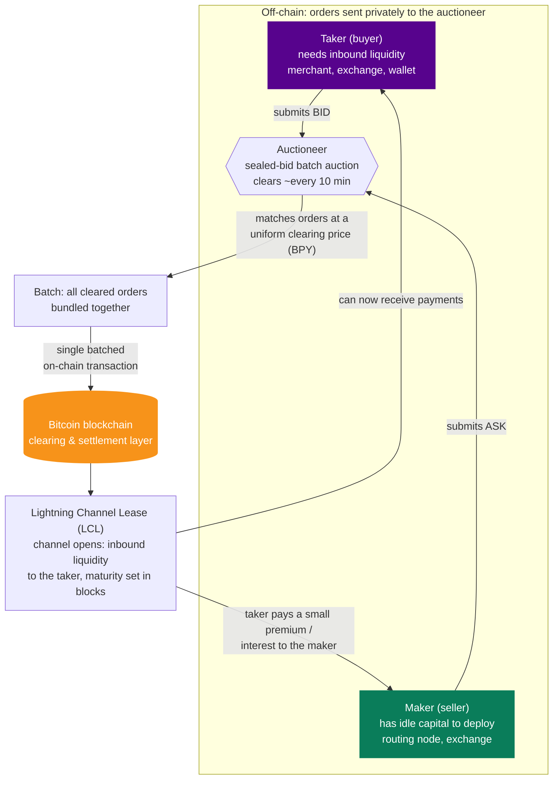

# What Is a Lightning Pool? A Beginner's Guide to the Liquidity Marketplace ⚡🏊

_By Delleon McGlone 

If you've spent any time running a Lightning node, you've bumped into the same
wall almost everyone does: you set up your wallet, open a channel, and then
discover you can't actually receive any bitcoin. Your channel is there, your node
is online, and payments still bounce. The culprit is almost always **inbound
liquidity**, and Lightning Pool is the marketplace built to solve it. In this
post, we'll explain what Lightning Pool is, the problem it solves, and how the
auction underneath it actually works.

## First, the Problem: Why Liquidity Is Scarce

The Lightning Network is a fully collateralized system. To receive up to N
bitcoin over a channel, some other peer on the network must first commit at least
N bitcoin into a channel pointed at you. That capacity to receive is what we call
**inbound liquidity**, and for a new node it starts at zero.

This creates a chicken-and-egg problem. A merchant who wants to accept Lightning
payments needs inbound liquidity before a single customer can pay them. A new
wallet user can't receive funds until someone opens a channel in their direction.
And on the other side of the market, well-capitalized routing nodes have the
opposite problem: they have bitcoin to deploy but no reliable way to know where on
the network their capital is actually wanted.

Before Pool, people solved this by hand. Node operators posted on Twitter asking
for channels, joined Telegram groups to arrange mutually balanced opens, or paid
one-off over-the-counter services to open capacity toward them. These solutions
proved the demand was real, but none of them scaled. The most efficient way to
match a scarce resource to the people who want it most is a deep, two-sided
marketplace. That is exactly what Lightning Pool is.

## What Lightning Pool Actually Is

Lightning Pool is a **non-custodial, peer-to-peer marketplace** where Lightning
node operators buy and sell channel liquidity. It turns inbound liquidity into a
tradeable asset, letting one side instantly acquire the capacity they need to
receive payments, and letting the other side earn a yield on idle bitcoin by
leasing that capacity out.

The market has two natural sides:

- **Takers (buyers)** are nodes that need to receive funds over Lightning:
  merchants, exchanges, wallets, and services. They submit a **bid** to purchase
  new inbound liquidity.
- **Makers (sellers)** are nodes with capital to deploy: well-capitalized routing
  nodes and exchanges. They submit an **ask** to lease their existing outbound
  liquidity to a taker and earn a return.

Crucially, Pool is **non-custodial**. Participants fund an on-chain account held
in a 2-of-2 multi-sig output, and the client must sign off on every transfer. The
auctioneer can never withdraw a user's funds; only the user can. You stay in
control of your bitcoin from the moment you open an account through the clearing
and execution of your contract.

## The Product on the Shelf: Lightning Channel Leases

The thing being bought and sold on Pool is a **Lightning Channel Lease (LCL)**.
An LCL is a hybrid asset that borrows from two very different worlds. It behaves
partly like a traditional fixed-income instrument such as a bond, and partly like
the peering agreements internet service providers use to coordinate bandwidth
between their networks.

Like a bond, an LCL has a maturity date, expressed in blocks and enforced by
Bitcoin contracts. The buyer is guaranteed use of the leased capital for a set
period of time, and pays interest to the seller over the life of the contract.
Like an internet peering agreement, it's fundamentally about allocating
connectivity: capital in a channel is the transportation infrastructure that
carries payments across the network.

The elegance is in the economics. A merchant doesn't have to front the full
amount of liquidity they want pointed at them. They might pay a small premium, say
1,000 satoshis, to have 1,000,000 satoshis committed toward their node for the
duration of the lease. The maker, meanwhile, keeps full control of that capital
the entire time and simply earns yield for allocating it where the market says
it's needed.

## Under the Hood: How the Auction Works

Pool isn't a continuous order book like a typical exchange. It's a
**discrete-interval, non-custodial, sealed-bid, uniform clearing-price, batched
auction** that runs roughly every 10 minutes. That's a mouthful, so here's what
each piece means and why it matters.

**Discrete-interval.** Instead of clearing continuously, the market clears
periodically in batches. This design eliminates whole classes of problems like
order sniping and front-running, and it lines up naturally with Bitcoin's block
interval, which sets a lower bound on execution latency anyway. Each cleared batch
reveals the current lease rate for capital on the network.

**Sealed-bid.** All bids and asks go only to the auctioneer. No participant can
see another's order and try to undercut or snipe it. Everyone is incentivized to
bid what they honestly believe inbound liquidity is worth.

**Uniform clearing price.** Every order that clears in a batch pays the same
price, the same way the U.S. Treasury clears auctions for treasury bills. This is
widely considered "more fair," because it pushes participants to bid their true
valuation. A useful rule of thumb: you get your posted price or better when your
order clears.

**Batched execution.** All the orders that clear in a given epoch are bundled
into a single on-chain transaction. Because everyone shares the batch, each
participant pays lower chain fees than they would opening a channel in isolation.
As the marketplace grows, opening a channel through Pool can actually become
cheaper than doing it on your own.

From each successful batch, the market discovers a per-block lease rate, the
**Block Percentage Yield (BPY)**, which is effectively the going interest rate for
capital on Lightning.

Here's the whole flow at a glance, from order submission to a live leased channel:

## Don't Trust, Verify

Pool's backend auctioneer is operated by Lightning Labs, but you don't have to
take its word for anything. The system can be understood as a **"Shadowchain"**
anchored to Bitcoin: the auctioneer proposes batches, and the clients involved
validate and accept each state transition themselves. Newer clients can even audit
the system's prior history.

That gives Pool some strong security properties. Because it's non-custodial, users
control their funds at all times. If the auctioneer server were hacked, the breach
would not unilaterally compromise user funds. One trader's orders can't be used to
spoof another's. And clients can verify that order matching and batch construction
were carried out correctly. Pool uses the Bitcoin blockchain for exactly what it's
best at: global, censorship-resistant batch settlement.

## Why It Matters for the Whole Network

Pool is really a solution to a resource-allocation problem dressed up in the
language of market design, the same branch of economics behind carbon-credit
markets, electricity markets, and wireless-spectrum auctions. By giving the
Lightning Network a real pricing signal, it helps capital flow to where it's
genuinely demanded instead of being guessed at.

That has knock-on benefits for everyone. New users can be onboarded directly onto
Lightning with both send and receive capacity from day one. Routing node operators
finally have a market signal telling them where their channels will actually be
used, rather than speculatively "building roads no one drives on." Merchants and
services can bootstrap the inbound capacity they need to accept payments. And
routing nodes get compensated for the cost and risk of committing their capital
even during quiet periods when they aren't earning forwarding fees.

Put simply: when node operators can deploy capital efficiently, the entire network
becomes more reliable and resilient for everyone on it.

## Diving In

If you're comfortable with low-level node operation, you can try Pool today. It
runs as a daemon, `poold`, backed by an active `lnd` node, much like Lightning
Loop's `loopd`. You can drive it from the reference
[Go client and `pool` CLI](https://github.com/lightninglabs/pool), or through the
[gRPC](https://lightning.engineering/poolapi/index.html#pool-grpc-api-reference)
and [REST](https://lightning.engineering/poolapi/index.html#pool-rest-api-reference)
APIs, and it's also available inside Lightning Terminal. For the full architecture
and design, the
[technical deep-dive](https://lightning.engineering/posts/2020-11-02-pool-deep-dive/)
and the
[Lightning Pool white paper](https://lightning.engineering/lightning-pool-whitepaper.pdf)
are the definitive references.

Lightning Pool takes one of the network's oldest pain points, the scramble for
inbound liquidity, and turns it into a clean, market-based mechanism where
liquidity is a yield-bearing, bitcoin-native asset. Whether you're a merchant who
needs to receive, a power user with capital to deploy, or anything in between,
that's a market worth understanding. Here's to the real future of finance. ₿🥂

---

_Primary sources:_
[Lightning Pool Is Open for Business](https://lightning.engineering/posts/2020-11-02-lightning-pool/)
and
[Lightning Pool: A Technical Deep-Dive](https://lightning.engineering/posts/2020-11-02-pool-deep-dive/)
by Olaoluwa Osuntokun, Lightning Labs.

---

_Part of [Lightning Labs Prep](../README.md). Study notes behind this article:
[04 — Pool: Auctions & Lease Pricing](../04-pool-auctions-lease-pricing.md) and
[05 — Pool: Observations from Running It Live](../05-pool-observations.md)._
